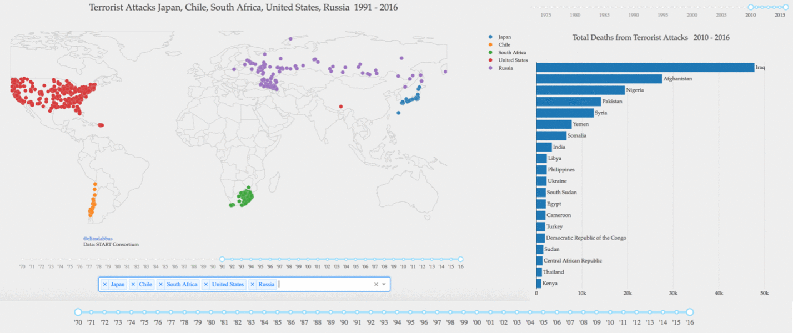

# Global Terrorism Database Interactive Dashboard
Interactive dashboard for visualizing the dataset. 

[Explore the live dashboard here.](https://goo.gl/sxYD1y)

Here is a quick video showing how it works and what is available: 

Technologies used: 
- Programming language: Python
- Packages: 
    - Plotly: charts and data visualization
    - Plotly's Dash: interactivity 
    - Pandas: handling data frames and their processing
    - Heroku: hosting / app management
    
Data: National Consortium for the Study of Terrorism and Responses to Terrorism (START). (2016). Global Terrorism Database [Data file](https://www.kaggle.com/START-UMD/gtd/downloads/gtd.zip/2). Retrieved from https://www.start.umd.edu/gtd
    
